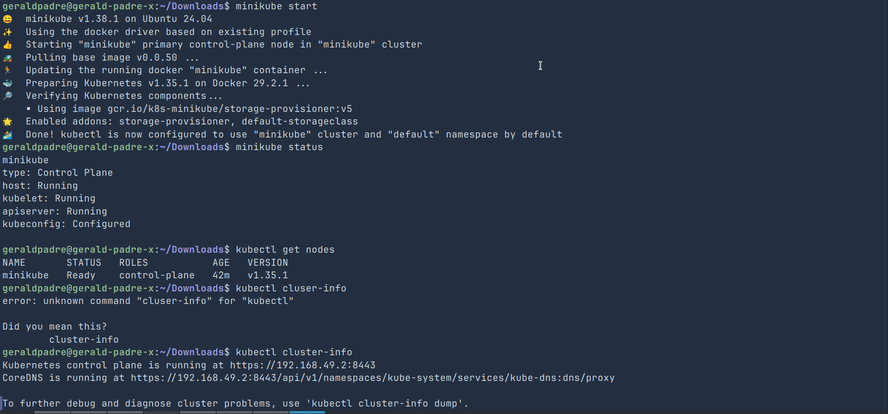
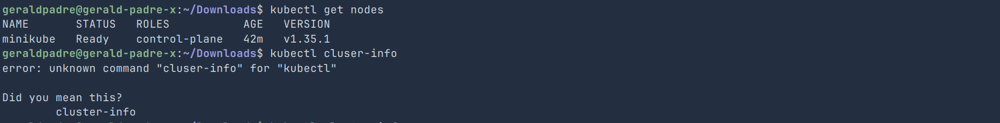
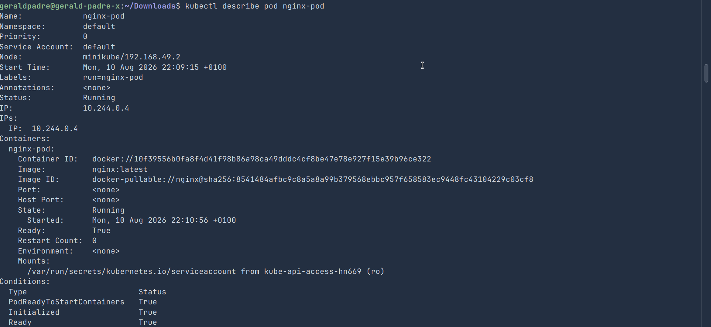
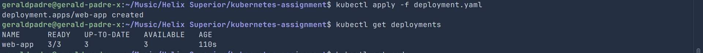
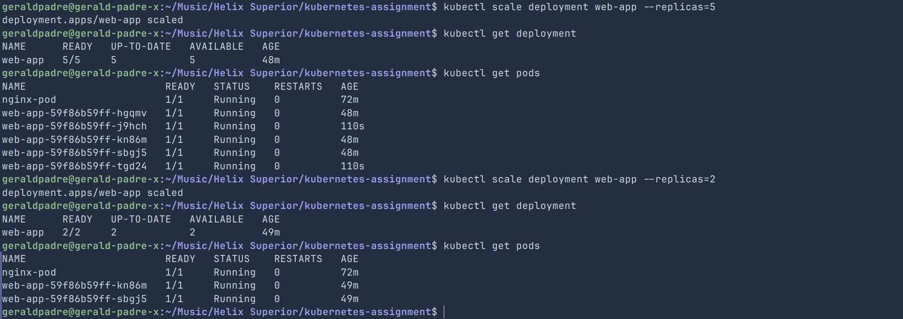
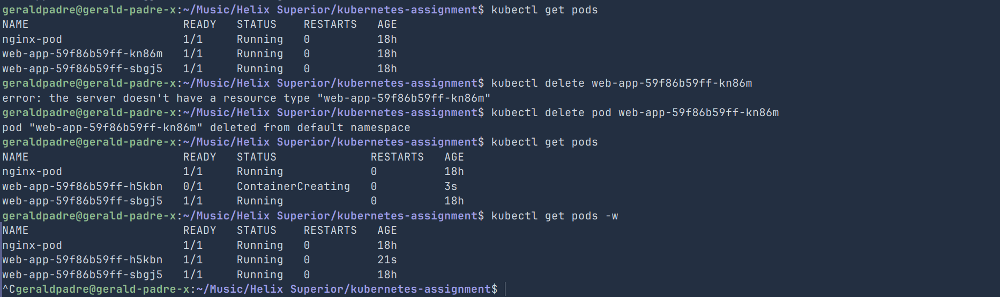
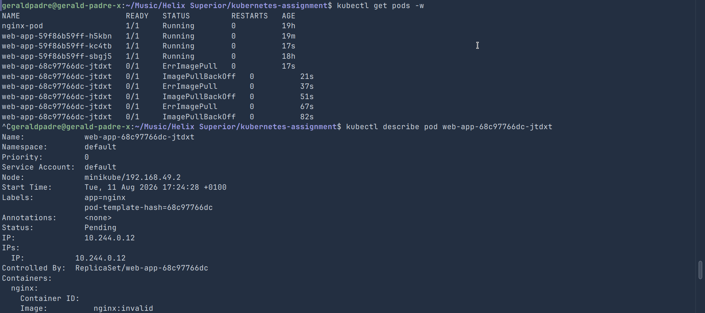

# Kubernetes Pods & Deployments — Minikube Practical

### Student Information

    Name: Gerald Izuchukwu

---

## 1. Minikube Setup

I started a local Kubernetes cluster using:

```bash
minikube start
```

Verified it was running with:

```bash
minikube status
```

All components (`host`, `kubelet`, `apiserver`, `kubeconfig`) reported as running/configured.

I then confirmed the node was ready and inspected cluster info:

```bash
kubectl get nodes
kubectl cluster-info
```

**Node name:** minikube
**Kubernetes version:** v1.35.1
**Node status:** `Ready`

Minikube's purpose is to run a lightweight, single-node Kubernetes cluster locally so developers can build and test against a real Kubernetes API without needing a full multi-node production cluster.




---

## 2. Pod

I created a standalone Pod running Nginx:

```bash
kubectl run nginx-pod --image=nginx:latest
```

Verified it:

```bash
kubectl get pods
kubectl get pods -o wide
```

Inspected it in detail:

```bash
kubectl describe pod nginx-pod
kubectl get pod nginx-pod -o yaml
```

**Image:** `nginx:latest`
**Status:** `Running`
**Node:** minikube
**Pod IP:** 10.244.0.4
**Container count:** 1

`kubectl describe` provides a detailed, human-readable view of an object's spec, current status, and recent events — useful for troubleshooting since it surfaces the event log (scheduling, image pulls, restarts, errors) that `kubectl get` doesn't show.



---

## 3. Deployment

I created `manifests/deployment.yaml` defining a Deployment named `web-app`, running a container named `nginx` from the `nginx:latest` image, with 3 initial replicas.

Applied it:

```bash
kubectl apply -f manifests/deployment.yaml
kubectl get deployments
kubectl get pods
kubectl get pods -o wide
```

**Pods created:** 3
**Deployment name:** `web-app`
**Image used:** `nginx:latest`

**Difference from the standalone Pod:** the standalone `nginx-pod` is unmanaged — if it's deleted, nothing recreates it. The Deployment-managed Pods are owned by a ReplicaSet, which continuously reconciles the actual Pod count against the desired state (`replicas: 3`), automatically recreating any Pod that's deleted or crashes.

**Why use a Deployment:** it gives declarative, self-healing management of Pods — automatic recovery, easy scaling, and rolling updates/rollbacks — instead of manually tracking and recreating individual Pods.



---

## 4. Scaling

Starting from 3 replicas, I scaled up:

```bash
kubectl scale deployment web-app --replicas=5
kubectl get deployment
kubectl get pods
```

Then scaled down:

```bash
kubectl scale deployment web-app --replicas=2
kubectl get deployment
kubectl get pods
```

**Pods before scaling:** 3
**Pods after scaling to 5:** 5
**Pods after scaling down to 2:** 2
**Command used:** `kubectl scale deployment web-app --replicas=<n>`

Scaling a Deployment is easier than manually creating/deleting Pods because a single declarative command updates the desired count, and the ReplicaSet controller handles creating or terminating the right number of Pods automatically — no manual tracking or risk of naming collisions.



---

## 5. Self-Healing

With the Deployment at 2 replicas, I checked existing Pods, then deleted one:

```bash
kubectl get pods
kubectl delete pod <pod-name>
kubectl get pods
```

**What happened:** immediately after deletion, Kubernetes created a replacement Pod (new name/suffix) to restore the desired count of 2.
**Pods after Kubernetes finished:** 2
**Manually created the new Pod?** No.
**Why Kubernetes created a replacement:** the ReplicaSet controller continuously compares the actual Pod count to the desired state and creates new Pods to close any gap.

**Concept demonstrated:** self-healing / desired-state reconciliation.



---

## 6. Troubleshooting

I intentionally broke the Deployment by changing the image to an invalid tag:

```yaml
image: nginx:invalid
```

Applied it and observed the failure:

```bash
kubectl apply -f manifests/deployment.yaml
kubectl get pods
kubectl describe pod <pod-name>
```

**Pod status:** `ImagePullBackOff` (preceded by `ErrImagePull`)
**Error in events:** image pull failure — the registry has no manifest for the tag `nginx:invalid`.
**Why it failed:** Docker Hub doesn't have an image tagged `nginx:invalid`, so the container runtime can't pull it and the container never starts.
**Fix:** reverted the image back to `nginx:latest` and reapplied the Deployment, after which Pods returned to `Running`.

```bash
kubectl apply -f manifests/deployment.yaml
kubectl get pods
```



---

## Clean Up

```bash
kubectl delete deployment web-app
kubectl delete pod nginx-pod
kubectl get pods
minikube stop
```
