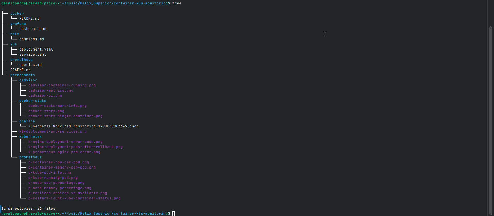

# Container & Kubernetes Monitoring Lab

## 1. Project Overview

This project sets up end-to-end observability for containerized and Kubernetes workloads. It covers two layers:

- **Docker layer**: monitoring standalone containers with `docker stats` and cAdvisor.
- **Kubernetes layer**: monitoring a Kubernetes `Deployment` + `Service` with the `kube-prometheus-stack` (Prometheus + Grafana + node-exporter + kube-state-metrics), installed via Helm.

The Kubernetes workload is a 3-replica Nginx deployment. Metrics are queried in Prometheus with PromQL and visualized on a custom 6-panel Grafana dashboard. A workload failure was deliberately triggered and diagnosed using the monitoring stack, and Helm was used to inspect the installed release.

## 2. Environment

```
OS: Ubuntu (Linux)
Docker: <fill in from `docker version`>
Kubernetes: Minikube (driver: docker)
Helm: <fill in from `helm version`>
```

> Run `lsb_release -a`, `docker version`, `minikube version`, `helm version` and `kubectl version --client` to fill in exact versions before submitting.

## 3. Deployment Instructions

### 3.1 Repo structure

```
container-k8s-monitoring/
│
├── README.md
│
├── docker/
│   └── README.md
│
├── k8s/
│   ├── deployment.yaml
│   └── service.yaml
│
├── prometheus/
│   └── queries.md
│
├── grafana/
│   └── dashboard.md
│
├── helm/
│   └── commands.md
│
└── screenshots/
    ├── docker-stats/
    ├── cadvisor/
    ├── prometheus/
    ├── grafana/
    └── kubernetes/
```

### 3.2 Part 1 — Docker container monitoring

Run at least 3 containers, with load on at least one so its resource usage is observable:

```bash
docker run -d --name nginx-monitor -p 8080:80 --memory=256m nginx
docker run -d --name redis-monitor --memory=256m redis
docker run -d --name postgres-monitor --memory=512m -e POSTGRES_PASSWORD=secret postgres
docker run -d --name cpu-stress --cpus=0.5 --memory=128m alpine sh -c "while true; do :; done"
```

Generate traffic and I/O so the stats aren't flat:

```bash
for i in $(seq 1 5000); do curl -s localhost:8080 > /dev/null; done
docker exec postgres-monitor sh -c "dd if=/dev/zero of=/tmp/testfile bs=1M count=500 conv=fsync"
```

Monitor:

```bash
docker stats
docker stats --no-stream
docker stats nginx-monitor
```

### 3.3 Part 2 — cAdvisor

```bash
docker run -d --name=cadvisor \
  -p 8081:8080 \
  --volume=/:/rootfs:ro \
  --volume=/var/run:/var/run:ro \
  --volume=/sys:/sys:ro \
  --volume=/var/lib/docker/:/var/lib/docker:ro \
  --volume=/dev/disk/:/dev/disk:ro \
  --privileged \
  --device=/dev/kmsg \
  gcr.io/cadvisor/cadvisor:v0.49.1
```

Web UI: `http://localhost:8081`
Prometheus-format metrics: `http://localhost:8081/metrics`

Standalone containers and cAdvisor were removed after this part to free resources before starting the Kubernetes work.

### 3.4 Part 3 — Kubernetes workload

```bash
minikube start --cpus=4 --memory=6144 --driver=docker
kubectl apply -f k8s/
kubectl get deployments,pods,svc -o wide
```

`k8s/deployment.yaml` defines a 3-replica Nginx `Deployment` with explicit CPU/memory `requests` and `limits`. `k8s/service.yaml` exposes it via a `ClusterIP` Service.

### 3.5 Part 4 — Install kube-prometheus-stack via Helm

```bash
helm repo add prometheus-community https://prometheus-community.github.io/helm-charts
helm repo update
helm install monitoring prometheus-community/kube-prometheus-stack \
  --namespace monitoring2 --create-namespace
kubectl get pods -n monitoring2
```

> **Note:** the release name is `monitoring`, but it is installed in the **`monitoring2`** namespace (not `monitoring`) on this setup. All `kubectl`/`helm` commands below target `-n monitoring2` accordingly.

### 3.6 Part 5 — Prometheus

```bash
kubectl port-forward -n monitoring2 svc/monitoring-kube-prometheus-prometheus 9090:9090
```

Open `http://localhost:9090`. Six or more PromQL queries are documented, with expression, purpose, and screenshot, in [`prometheus/queries.md`](./prometheus/queries.md).

### 3.7 Part 6 — Grafana

```bash
kubectl port-forward -n monitoring2 svc/monitoring-grafana 3000:80
kubectl get secret -n monitoring2 monitoring-grafana \
  -o jsonpath="{.data.admin-password}" | base64 -d; echo
```

Open `http://localhost:3000`, log in as `admin` with the password above. A 6-panel dashboard ("Kubernetes Workload Monitoring") was built covering CPU usage, memory usage, pod count, pod restarts, deployment replicas, and node resource usage. Panel definitions are in [`grafana/dashboard.md`](./grafana/dashboard.md).

### 3.8 Part 7 — Workload failure simulation

Two failures were deliberately triggered and diagnosed using `kubectl` plus the Prometheus/Grafana stack. Full writeup: see [Section 5](#5-workload-failure-simulation) below.

### 3.9 Part 8 — Helm verification

```bash
helm list -n monitoring2
helm status monitoring -n monitoring2
helm get values monitoring -n monitoring2
helm get manifest monitoring -n monitoring2
```

Commands and trimmed output are documented in [`helm/commands.md`](./helm/commands.md).

---

## 4. Discoveries & Troubleshooting Notes

These are real issues hit while building this out, kept here so another engineer reproducing this setup doesn't have to rediscover them.

### 4.1 Namespace mismatch: release is `monitoring`, namespace is `monitoring2`

The Helm **release name** (`monitoring`) and the **namespace** it was installed into (`monitoring2`) are not the same string. Resources created by the release are named with the `monitoring-` prefix (e.g. `monitoring-kube-prometheus-kubelet`, `monitoring-grafana`) but live in the `monitoring2` namespace, not a namespace literally called `monitoring`. Always verify with:

```bash
helm list -A
kubectl get all -A -l release=monitoring
```

### 4.2 `container` label is empty on this cAdvisor/Minikube setup

On this environment (Minikube, Docker driver), `container_cpu_usage_seconds_total` and related cAdvisor metrics are exposed with `container=""` — only the **pod-level cgroup aggregate** is present, not a per-container breakdown. This is a known quirk of how the Docker cgroup driver lays out cgroup slices under cAdvisor.

**Effect:** the commonly-used filter `container!=""` (meant to exclude the pause/infra container) silently excludes *every* row on this setup, returning empty results — not because the metric is missing, but because the only rows that exist have an empty `container` label.

**Fix:** drop the `container!=""` filter for workload-scoped queries on this environment:

```
sum(rate(container_cpu_usage_seconds_total{namespace="default"}[5m])) by (pod)
sum(container_memory_working_set_bytes{namespace="default"}) by (pod)
```

Verified by querying the kubelet's raw cAdvisor endpoint directly, bypassing Prometheus, to confirm the data existed at the source before assuming a scrape-config problem:

```bash
kubectl get --raw "/api/v1/nodes/minikube/proxy/metrics/cadvisor" | grep container_cpu_usage_seconds_total
```

### 4.3 CPU query returning `0` is correct, not broken

After fixing the label filter above, `sum(rate(container_cpu_usage_seconds_total{namespace="default"}[5m])) by (pod)` still returned `0` for every pod. This is expected, not a bug: `container_cpu_usage_seconds_total` is a **counter**, and `rate()` over it measures CPU-time actually **consumed** in the window — not CPU availability or headroom. Idle Nginx pods receiving no traffic genuinely consume ~0 CPU, so `0` is the correct reading.

Confirmed by generating load and re-querying:

```bash
kubectl port-forward pod/nginx-deployment-77bfc996b4-lqmbz 8080:80 &
for i in $(seq 1 20000); do curl -s localhost:8080 > /dev/null; done
```

Rerunning the query (in Graph view, not Table) while the load loop ran showed the target pod's CPU rate rise above `0`, confirming the full pipeline (cAdvisor → kubelet → Prometheus scrape → PromQL) works correctly end to end — the earlier `0` values were a true reading of an idle workload, not a broken pipeline.

By contrast, `container_memory_working_set_bytes` is a **gauge** (an absolute snapshot), so it returned nonzero values immediately even with no load — this difference in metric type is why memory "worked" before CPU appeared to.

### 4.4 Node-level metrics depend on a separate exporter

`node_cpu_seconds_total` and `node_memory_MemAvailable_bytes` (used for the Node CPU/Memory panel) are **not** emitted by cAdvisor or kubelet — they come from **node-exporter**, a separate DaemonSet installed as part of the stack. When these queries returned empty, the cause was unrelated to the cAdvisor/namespace issue above; it required checking node-exporter's pod status directly:

```bash
kubectl get pods -n monitoring2 -l app.kubernetes.io/name=node-exporter
kubectl logs -n monitoring2 -l app.kubernetes.io/name=node-exporter --tail=50
```

node-exporter needs host `/proc` and `/sys` mounted read-only; under the Minikube Docker driver, what actually gets mounted is the Minikube node *container's* view of `/proc`/`/sys`, not the physical host's — which can cause it to crash or misreport depending on the local Docker/cgroup configuration. This was resolved on this setup; see `helm/commands.md` / `prometheus/queries.md` for the working node queries once fixed.

---

## 5. Workload Failure Simulation

### 5.1 Failure A: Failed rollout (bad image → replica mismatch)

**What was broken:**

```bash
kubectl set image deployment/nginx-deployment nginx=nginx:does-not-exist
```

**What Kubernetes showed:**

```bash
kubectl get pods
kubectl describe pod <bad-pod-name>
```

New pods went to `ErrImagePull` / `ImagePullBackOff`; `describe` showed the image pull failure in `Events`, while the old replicas kept running (rollouts are gradual by default), so desired vs. available replica counts diverged.

**What metrics changed:** `kube_deployment_status_replicas_unavailable{deployment="nginx-deployment"}` went above 0; Grafana Panel 5 (Deployment Replicas) showed the desired/available lines separate.

**How it was identified:** `kubectl get pods` showing the bad status, cross-referenced against the replica-mismatch metric and dashboard panel.

**How it was resolved:**

```bash
kubectl rollout undo deployment/nginx-deployment
kubectl rollout status deployment/nginx-deployment
```

### 5.2 Failure B: Crash loop (restart counts)

**What was broken:**

```bash
kubectl create deployment crashy --image=busybox -- sh -c "echo starting; sleep 5; exit 1"
```

**What Kubernetes showed:** `kubectl get pods -w` showed the pod cycling into `CrashLoopBackOff`; `kubectl logs deploy/crashy --previous` showed the exit before crash.

**What metrics changed:** `kube_pod_container_status_restarts_total{pod=~"crashy.*"}` climbed with each restart; Grafana Panel 4 (Pod Restarts) showed the increase.

**How it was identified:** pod status transitions in `kubectl get pods -w`, confirmed against the restart-count metric climbing in Prometheus/Grafana.

**How it was resolved:**

```bash
kubectl delete deployment crashy
```

---

## 6. Files

- [`docker/README.md`](./docker/README.md) — Docker containers used and `docker stats` walkthrough
- [`k8s/deployment.yaml`](./k8s/deployment.yaml), [`k8s/service.yaml`](./k8s/service.yaml) — Kubernetes manifests
- [`prometheus/queries.md`](./prometheus/queries.md) — PromQL queries, purpose, screenshots
- [`grafana/dashboard.md`](./grafana/dashboard.md) — Dashboard panel definitions
- [`helm/commands.md`](./helm/commands.md) — Helm verification commands and output
- [`screenshots/`](./screenshots/) — Evidence for all parts

[](./screenshotsRepo-Structure.png)